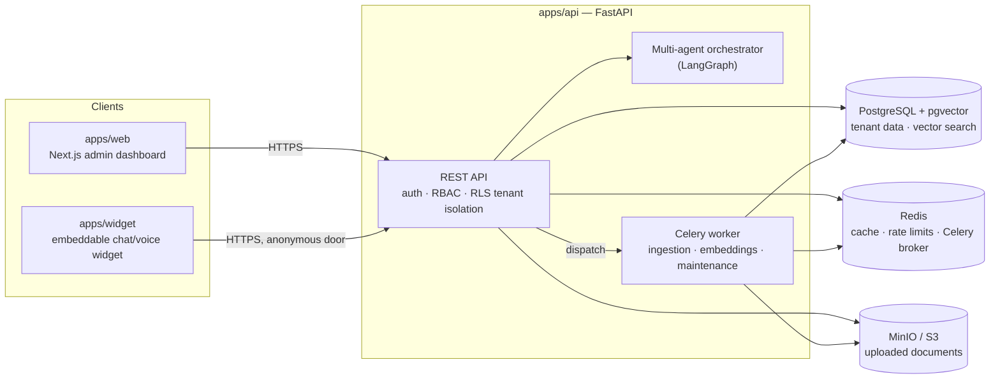

# AgentForge

[](https://github.com/AhmedIrfan7/agentforge/actions/workflows/lint.yml)
[](https://github.com/AhmedIrfan7/agentforge/actions/workflows/api-tests.yml)
[](https://github.com/AhmedIrfan7/agentforge/actions/workflows/web-tests.yml)
[](https://github.com/AhmedIrfan7/agentforge/actions/workflows/widget-tests.yml)
[](https://github.com/AhmedIrfan7/agentforge/actions/workflows/docker-build.yml)
[](https://github.com/AhmedIrfan7/agentforge/actions/workflows/codeql.yml)
[](https://github.com/AhmedIrfan7/agentforge/actions/workflows/dependency-audit.yml)
[](LICENSE)

Enterprise-grade, open-source, multi-tenant AI SaaS platform for building and deploying AI chatbots **and** AI voice bots that share one intelligence layer.

> Status: pre-beta, actively developed against a public 300-step roadmap ([`docs/ROADMAP.md`](docs/ROADMAP.md)) — Milestones 0–11 (steps 1–280) are complete: multi-tenant auth/RBAC, document ingestion + RAG retrieval, a multi-agent orchestrator, an admin dashboard, security hardening, and real deployment infrastructure (Docker images, CI/CD, staging/production deploy workflows). No tagged release or hosted instance exists yet — see [`docs/self-hosted-deployment.md`](docs/self-hosted-deployment.md) to run it yourself.

## What this is

AgentForge lets an organization upload knowledge, configure specialized AI agents, and deploy conversational assistants (chat + voice) through a simple embeddable widget — with real multi-tenant isolation, intelligent document chunking, explainable retrieval, and layered memory, not a thin wrapper around a single LLM call.

See [`AGENTS.md`](AGENTS.md) for the full product/engineering constitution this project is built against, and [`docs/ARCHITECTURE.md`](docs/ARCHITECTURE.md) for the technical design as it's implemented.

## Architecture



Full detail — data model, RAG pipeline, memory architecture, security design — is in [`docs/ARCHITECTURE.md`](docs/ARCHITECTURE.md). For the provider/agent interfaces built for extension (LLM, embeddings, voice, OAuth, agents), see [`docs/extension-points.md`](docs/extension-points.md). For the REST API itself, see [`docs/api-reference.md`](docs/api-reference.md) (OpenAPI-generated, `/docs` and `/redoc` when the server is running).

## Repository layout

```
apps/
  api/      FastAPI backend — multi-agent orchestrator, RAG pipeline, REST API
  web/      Next.js admin dashboard
  widget/   Embeddable chat/voice widget (vanilla TS, framework-free)
packages/
  shared/   Cross-app TypeScript types/contracts
infra/      Docker, deployment, infrastructure-as-code
docs/       Architecture docs, ADRs, roadmap
```

## Stack

Python + FastAPI · Next.js/React · PostgreSQL + pgvector · Redis + Celery · MinIO/S3 · LangGraph · Docker Compose.

Rationale for each choice: [`docs/adr/0001-technology-stack.md`](docs/adr/0001-technology-stack.md).

## Quickstart (local development)

Prerequisites: Docker, Node.js 22+, [pnpm](https://pnpm.io), Python 3.12+, [uv](https://docs.astral.sh/uv/).

```bash
git clone https://github.com/AhmedIrfan7/agentforge.git
cd agentforge

make install       # apps/api's own uv sync + pnpm install for the whole workspace
make up            # starts Postgres+pgvector, Redis, MinIO, ClamAV via docker compose
cp apps/api/.env.example apps/api/.env
cp apps/web/.env.example apps/web/.env.local

make api-migrate   # applies every real Alembic migration
make api-seed      # idempotent — seeds a demo org/workspace/user

make api-dev       # FastAPI dev server, http://localhost:8000
make worker-dev    # in a third terminal — Celery worker, processes uploaded documents
make web-dev       # in a second terminal — Next.js dev server, http://localhost:3000
```

`make api-seed` creates a demo organization/workspace/user plus a demo knowledge base, a demo document, and a demo assistant — a real, queryable example, not just an empty shell. The document only finishes processing (extraction → chunking → embedding) once `make worker-dev` is running.

`make help` lists every other real command (lint/format/test/backup/restore-drill). For running the full stack in a production-like shape instead of separate dev servers, see [`docs/self-hosted-deployment.md`](docs/self-hosted-deployment.md).

## Screenshots

Coming soon — the dashboard and embeddable widget are real and functional today (the Quickstart above runs them); this README doesn't have visual captures embedded yet. Tracked honestly rather than faked.

## FAQ

Common questions about what this is, the stack, hosting, and licensing: [`FAQ.md`](FAQ.md).

## Changelog

[`CHANGELOG.md`](CHANGELOG.md) — versioning policy and what's changed. No release has been tagged yet.

## Contributing

Not yet open for external contributions — see [`CONTRIBUTING.md`](CONTRIBUTING.md) for the current status and plan.

## Roadmap

Full 300-step roadmap with every individual step: [`docs/ROADMAP.md`](docs/ROADMAP.md). Live progress tracking: [GitHub Milestones](https://github.com/AhmedIrfan7/agentforge/milestones).

| Milestone | Status |
| --- | --- |
| 0 — Foundation | ✅ Complete |
| 1 — Multi-Tenancy Core | ✅ Complete |
| 2 — Authentication & Authorization | ✅ Complete |
| 3 — Knowledge Pipeline: Ingestion + RAG | ✅ Complete |
| 4 — Agent System | ✅ Complete |
| 5 — Memory System | ✅ Complete |
| 6 — Conversation Engine | ✅ Complete |
| 7 — Embeddable Widget | ✅ Complete |
| 8 — Voice Platform | ✅ Complete |
| 9 — Admin Dashboard & Analytics | ✅ Complete |
| 10 — Security & Observability | ✅ Complete |
| 11 — Infrastructure & Deployment | ✅ Complete |
| 12 — Open Source Readiness / Public Beta | 🚧 In progress |
| 13 — v1.0 Release | ⬜ Not started |

## License

[Apache 2.0](LICENSE)
